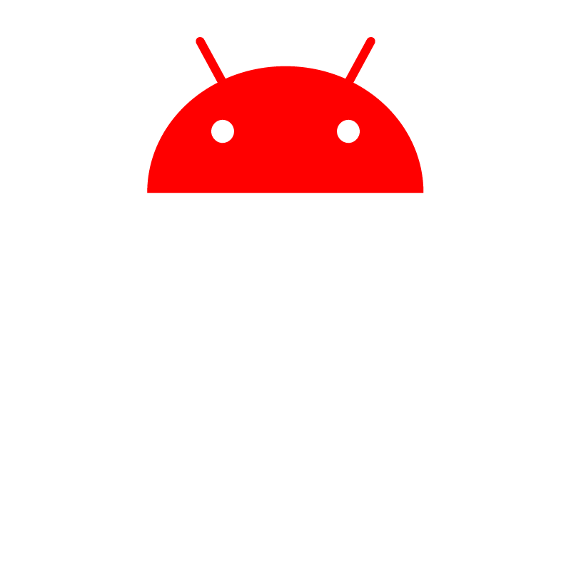
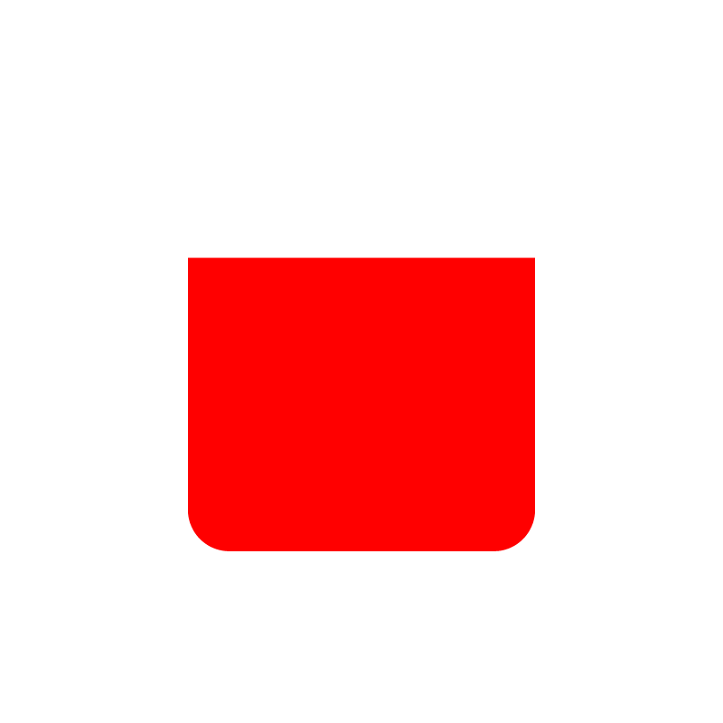
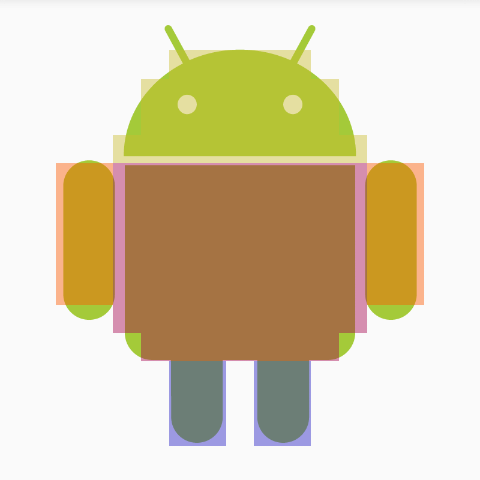

ImageMask
==========
Android library to map clickable areas on an `ImageView`.
Specify your clickable areas using drawables.

## Example of use

You wish to map touch events on image areas in Android: this library is made for you!

You can map clicks on areas defined by drawable masks.
|             Image to map            |                 head mask                  |                 arms mask                  |                 body mask                  |                 legs mask                  |
|:-----------------------------------:|:------------------------------------------:|:------------------------------------------:|:------------------------------------------:|:------------------------------------------:|
||||||
In this example each part of Android's droid body would be clickable independently.

## Getting started

### Dependency

Include the dependency in `build.gradle`:
```groovy
dependencies {
    compile 'fr.bigint.imagemask:imagemask:1.0.0'
}
```
## Usage
First, create a `MaskMapImageView` and the mapping going along with it. Then listen to touch events.
### Create mapping in XML
Create a MaskMapImageView from XML layout file.
```xml
<fr.bigint.imagemask.MaskMapImageView
	android:layout_width="wrap_content"
	android:layout_height="wrap_content"
	android:scaleType="fitCenter"
	android:src="@drawable/droid"
	mask:masks="@array/image_masks"/>
```
Attribute `masks` references an array of drawables. Let's create it in a custom XML file called
`mappings.xml`. You can create this file in `res/values` folder for example.
```xml
<resources>
	<integer-array name="image_masks">
		<item>@drawable/head</item>
		<item>@drawable/arms</item>
		<item>@drawable/body</item>
		<item>@drawable/legs</item>
	</integer-array>
</resources>
```
All opaque areas of the drawables from this array will be clickable areas in the created ImageView.
### Create mapping programmatically

```java
MaskDefinition[] maskDefinitions = {
	new MaskDefinition(R.drawable.head, MaskConfig.getOpacityMaskConfig(1), "head"),
	new MaskDefinition(R.drawable.arms, MaskConfig.getOpacityMaskConfig(1), "arms"),
	new MaskDefinition(R.drawable.body, MaskConfig.getOpacityMaskConfig(1), "body"),
	new MaskDefinition(R.drawable.legs, MaskConfig.getOpacityMaskConfig(1), "legs"),
};
maskMapImageView.setMasks(maskDefinitions);
```
### Listen to mapped touch events
Register an `OnMaskTouchListener` to listen to mapped touch events. You can identify which mask
has been touched relying on `mask` which is the drawable id used to create the mask and `tag` which
is the tag associated to the mask at creation time.

> **Note:** Tags can only be specified programmaticaly

```java
maskMapImageView.setOnMaskTouchListener(new MaskMapImageView.OnMaskTouchListener() {
	@Override
	public void onMaskPressed(int mask, Object tag) {
	}

	@Override
	public void onMaskUnpressed(int mask, Object tag) {
	}
	
	@Override
	public void onMaskClick(int mask, Object tag) {
	}
});
```


-------------------------------------------------------------------------------------------------
## Masks configuration

```xml
<fr.bigint.imagemask.MaskMapImageView
		android:id="@+id/mask_mapping_image_view"
		android:layout_width="wrap_content"
		android:layout_height="wrap_content"
		android:scaleType="fitCenter"
		android:src="@drawable/droid"
		mask:masks="@array/droid_masks"
		mask:mask_type="include_color"
		mask:mask_color="#FFFF0000"
		mask:mask_weight="0.5"
		mask:mask_showDebugOverlay="true"/>
```

* **masks** is a reference to the array of drawables
  contained in `mappings.xml`. These drawables will
  be used by the view to generate bit masks in order to map
  touch events. If this attribute is not defined there will
  be no mapping generated by the view.

* **mask_type** defines the way masks will
  be created from drawables. This attribute can take 4 values:
  `opacity`, `transparency`, `includeColor` or `excludeColor`.
  Default value: `opacity`.

* **mask_color** defines the color used to create masks
  when **mask_type** is `includeColor` or `excludeColor`.
  Default value: #00000000.

 * **mask_showDebugOverlay** if true a debug overlay will
   be printed onto the image. It represents masks as semi-transparent overlays of different colors see the method `MaskMapImageView.setDebugOverlayEnabled(boolean)` for
   details. Default value is false.

* **mask_weight** defines the relative weight of the mask
  in memory. By default the weight is 1.0 which means that 1 pixel
  of the drawable supplied to create the mask will occupy 1 bit in
  memory. You can set the weight in ]0, 1] interval in which case
  the mask will occupy (weight) * 1 bit per pixel.
> **Warning:** the precision of the mask will decrease accordingly. Make sure your mask
  is still correct using the debug overlay.

|               Without debug overlay             |                    weight = 1                  |                    weight = 0.25                  |                    weight = 0.08                  |                    weight = 0.02                  |
|:-------------------------------------------------:|:------------------------------------------------------:|:------------------------------------------------------:|:------------------------------------------------------:|:------------------------------------------------------:|
||||||

For more details on masks configuration please refer to javadoc and try to play around with the sample app.